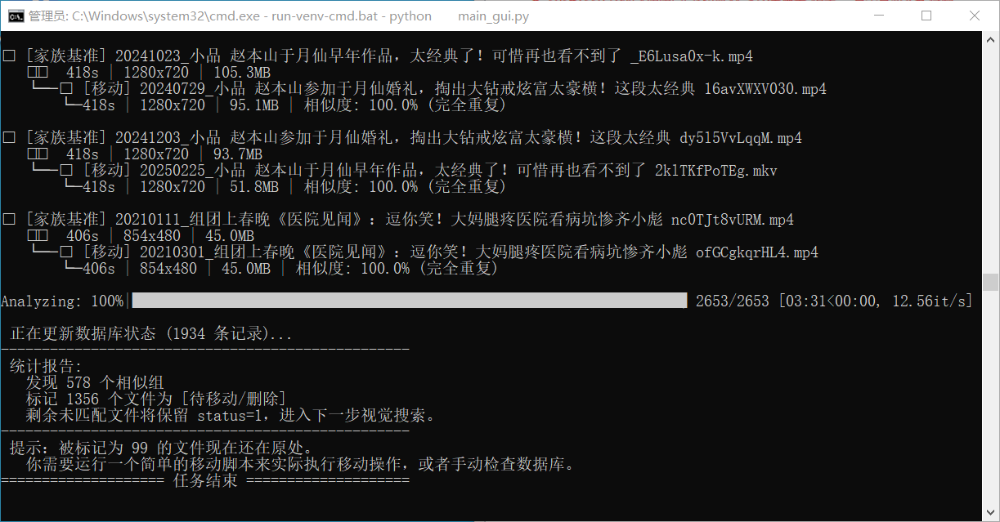

# 🎬 VideoDeduper (视频多模态去重指挥官)


> **专为海量视频囤积者、二创剪辑师打造的“多维度、防洗稿”桌面级去重引擎。**

在短视频洗稿横行的时代，单纯对比文件 MD5 甚至计算画面相似度已经彻底失效。本项目创新性地引入了 **声学特征 (Audio) + 视觉矩阵 (Visual) + 语义台词 (ASR Text)** 三维交叉验证，精准揪出被“掐头去尾、变速变调、镜像翻转、换皮配音”的深度洗稿视频。

---

## 🌟 核心特性 (Key Features)

### 1. 多模态降维打击
*   🎵 **音频初筛 (fpcalc)**：提取底层声学指纹，即使画面全换，只要 BGM 或声音底噪同源，瞬间暴露。
*   👁️ **视觉倒排搜索 (pHash)**：引入 NumPy 矩阵广播加速与位运算，实现 O(1) 级别的海量哈希汉明距离比对，比传统 `for` 循环快百倍。
*   💬 **AI 台词去重 (FunASR ONNX)**：彻底离线运行阿里 Paraformer 大模型，提取台词并进行 O(1) 字典秒杀与模糊字符匹配（数学熔断器机制），哪怕对方换了配音，只要台词剧本一样，依然判定重复！

### 2. 纯离线与隐私安全
*   所有 AI 推理和特征提取均在本地 CPU/GPU 运行。
*   无需调用任何云端 API，完全保护你的私密视频库资产。

### 3. 工程化 GUI 体验
*   支持**多任务工作区**隔离，每个项目独立配置。
*   内置 SQLite 状态机，中途崩溃进度不丢失，支持断点续传。
*   提供“外部单文件查重沙盒”及深度对白实锤报告。

---

## 📸 界面预览 (Screenshots)

### 主界面全览 (带有清晰的父子节点树状视图)


### 深度对比报告 (AI 语义实锤，有理有据)


### 人工溯源排查 (全库相似度矩阵，便捷多选剪切)


### 沙盒查重模式 (像杀毒软件一样鉴定外部视频)


---
### 对比过程的命令行输出(漫长的对比过程中可以了解进度)




---

## 🚀 快速体验 (面向普通用户)

无需配置复杂的 Python 环境，小白用户可以直接下载打包好的开箱即用版。

1. 前往 [Releases](https://github.com/jamosnet/VideoDeduper/releases) 页面下载最新的 `VideoDeduper_Full.zip`。 
2. 解压到一个**纯英文路径**下。
3. 如果软件弹窗提示缺少依赖，请允许其自动下载（或手动将 `models` 文件夹与所需的 `.exe` 工具放入同级目录）。
4. 双击 `main_gui.exe` 开始你的去重之旅！


---

## 🛠️ 开发者指南 (源码部署)

本项目架构清晰，分为 `db_builder.py` (扫描建库)、`audio_cleaner.py` (音频初筛)、`visual_matcher.py` (视觉匹配) 和 `asr_processor.py` (台词提取) 四大核心模块，由 `main_gui.py` 统筹调度。欢迎开发者 Clone 并魔改。

### 1. 环境准备
推荐使用 Python 3.11 或更高版本。
```bash
git clone https://github.com/jamosnet/VideoDeduper.git
cd VideoDeduper
pip install -r requirements.txt
```
*(注意：本项目默认使用 PyTorch CPU 版本以保证兼容性，如需 GPU 加速请自行替换 PyTorch 版本)*

### 2. 补齐依赖项
由于版权与体积原因，源码库不包含第三方二进制工具和 AI 模型权重。
1.  下载 `ffmpeg.exe`, `ffprobe.exe` 和 `fpcalc.exe` 并放入项目根目录。
2.  前往 https://github.com/jamosnet/VideoDeduper/releases/tag/v1.0.0-asset  下载 `models` 文件夹，并解压到项目根目录。

### 3. 运行主程序
```bash
python main_gui.py
```

---


## 📦 外部依赖与 AI 模型的来源说明 (致开发者)

本项目在开发和打包过程中，为了追求极致的轻量化与本地执行效率，对第三方二进制工具和 AI 模型进行了特殊处理。如果你想从零还原开发环境，请参考以下来源：

### 1. 核心二进制工具 (.exe)
这三个工具是视音频特征提取的基石，请下载对应的 Windows 版本，并放置在项目根目录（打包时 `.spec` 脚本会自动将它们拷贝到发布目录）：
*   **fpcalc.exe**: 用于提取音频的声学指纹（AcoustID）。
    *   下载来源：[Chromaprint 官网](https://acoustid.org/chromaprint)
*   **ffmpeg.exe & ffprobe.exe**: 用于极速读取视频元数据、提取音频流和画面抽帧。
    *   下载来源：[FFmpeg Windows Builds (如 gyan.dev 或 BtbN)](https://ffmpeg.org/download.html#build-windows)

### 2. 语音识别 ONNX 模型的“瘦身”魔法 (The ONNX Magic)
本项目使用的本地离线 ASR 模型（Paraformer / VAD / PUNC）经历了从 PyTorch 到 ONNX 的转化与“瘦身”过程，这也是为什么我们的运行环境不需要动辄几个 G 的 PyTorch：

1.  **初始获取与转化阶段**：
    最初，我们在开发环境中安装了完整的 `torch`, `torchaudio` 以及官方的 `funasr` 库。首次运行模型时，系统自动从魔搭社区（ModelScope）下载了 PyTorch 原生模型，并在本地将其导出了对应的 `.onnx` 格式文件。
2.  **环境清理与轻量化部署阶段**：
    拿到生成的 `.onnx` 模型文件（以及 `config.yaml`, `tokens.json` 等配置文件）并存入本项目的 `models/` 目录后，**我们彻底卸载了庞大的 PyTorch 生态**。
3.  **最终运行态**：
    代码中引入了高度精简的 `funasr-onnx` 和 `onnxruntime`。这样既保留了阿里工业级语音识别的极高精度，又将运行库的体积和内存占用压缩到了极致，非常适合桌面端 GUI 软件的分发。

> **💡 提示**: 如果你直接 Clone 本仓库进行二次开发，**无需**重复上述复杂的转化过程。只需下载打包好的 `models` 文件夹放入根目录，并使用 `pip install -r requirements.txt` 安装轻量级依赖即可直接运行。

---
### 👉  [关于这个项目：为什么视频去重这么难，以及我这 30 天到底经历了什么](./docs/why-video-deduplication-is-hard.md)


---


## 📚 常见问题 (FAQ)


**Q: 为什么会有 4 个按钮 (建库、音频、视觉、ASR)？必须按顺序点吗？**
> A: 是的，建议**从左到右依次点击**。本项目采用了**漏斗式过滤架构**：
> 1.  **建库**：极速扫描本地文件并读取媒体信息。
> 2.  **音频初筛**：速度极快，秒级排查背景音/BGM高度重合的视频（如直接照搬音轨的剪辑）。
> 3.  **视觉搜索**：中等耗时，通过抽帧对比画面矩阵，找出画面雷同但声音被替换的视频。
> 4.  **ASR台词**：最耗时但最精准，进行语义级的剧本重合度分析。
> **前置的快速筛选会大幅减少后续高耗时分析的工作量。** 已被前一步标记为“待删”的视频，不会参与后续的比对。

**Q: 为什么有些明显重复的视频没有被红名标记 (待删)？**
> A: 系统默认的相似度阈值设定较为保守，以防止误删珍贵的素材。你可以在主界面的“⚙️ 任务设置”中进行微调：
> *   如果你觉得**画面比对**太严格：适当调高 `HAMMING_TOLERANCE`（汉明距离容差，默认 9，建议不超过 15）或调低 `VISUAL_COVERAGE`。
> *   如果你觉得**台词比对**太严格：适当调低 `ASR_TEXT_THRESHOLD`（台词覆盖率，默认 0.6）。

**Q: 界面上的“合集抓取模式” (视图过滤) 是干什么用的？**
> A: 这是一个非常实用的专属视图过滤器！它的核心作用是帮你过滤掉普通的“1对1”重复视频，**只展示“大合集长视频”与“小切片短视频”之间的包含关系。**
> *   如果你平时喜欢下载 UP 主的长篇合集，又单独保存过其中的高光片段，勾选这个模式，你就能一眼看出哪些小片段已经被长合集囊括，从而放心删除碎片文件释放空间。

**Q: 点击右键的“✂️ 剪切选中文件到 [待确认/合集] 目录”有什么用？**
> A: 去重软件最怕的就是“一刀切”误删。当你面对算法给出的相似度报告犹豫不决时（比如两个视频极其相似，但你吃不准该留哪个），你可以使用此功能。
> *   它会将选中的可疑文件物理剪切到一个独立的安全隔离区（默认是源目录下的 `_待确认\_Manual_Sort` 文件夹）。
> *   同时，数据库会将该文件标记为 `100 (已移)`。这样它既不会被误删，也不会再参与后续的比对干扰你。

**Q: 为什么有时候移动/删除文件会失败？**
> A: 这通常是因为该视频文件正被其他程序（如本地播放器、剪辑软件）占用，导致 Windows 拒绝了移动或重命名请求。请关闭正在播放该视频的播放器，然后再次在 GUI 中执行操作。


**Q: 运行这个软件需要很高端的独立显卡 (GPU) 吗？**
> A: **完全不需要！** 为了让普通电脑也能流畅运行，本项目的 ASR（语音识别）底层已全部替换为**深度优化过的极速 ONNX 纯 CPU 推理模型**。只要你的电脑内存够用，哪怕是轻薄本也能搞定长视频的台词提取。

**Q: ASR 台词去重跑得很慢怎么办？中途可以关机吗？**
> A: 语音识别本质上是非常消耗 CPU 算力的过程。如果你的视频库达到上千个，建议在晚上睡觉前挂机运行。
> **完全可以随时关闭软件！** 系统采用本地 SQLite 实时落盘，下次打开继续运行时，会自动跳过已提取过特征的视频，**支持完美的断点续传**。

**Q: 软件会自动删除我的文件吗？我很担心源视频丢失。**
> A: **绝对不会。** 软件的所有去重判定，仅仅是修改底层数据库的 `Status` 状态（例如标记为 `99 待删`）。
> 在你手动点击主界面右上角红色的 **“✔️ 执行移动”** 按钮之前，你的任何物理文件都不会被删除或移动。并且，执行移动也只是将重复视频转移到专门的 `_Duplicates` 隔离区，给予你充分的后悔药。


**Q: 视频加了水印、或者分辨率被压缩了，还能识别出来吗？**
> A: **完全没问题。**
> 1. **音频和台词去重**是基于声音维度的，彻底无视画面上的任何视觉修改。
> 2. **视觉 pHash 去重**在底层会将画面统一压缩到 128x128 像素的灰度图再提取特征，这种算法天生对分辨率变化、亮度变化和局部小水印具有极强的免疫力。

**Q: 软件能自动把长篇的“合集”拆分成多个独立的小视频吗？**
> A: **不能。** 经过对海量视频的深度测试发现，大多数拼凑合集的剪辑手法极其随机（例如随意剪掉片头片尾、没有任何固定转场动画等），试图用纯算法进行完美的自动切割是不现实的。
> 本软件的价值在于帮你**找出它们之间的包含关系**——当软件提示某个长视频包含了你现有的几十个短视频时，你可以放心地保留短视频精选，并手动删掉那个臃肿的合集。

**Q: “🔍 深度对比报告”里的 ASR 报告，是怎么判断两句台词一样的？**
> A: 我们没有使用简单的“关键词命中”，而是尽最大努力模拟了人类的判定逻辑：
> 1. **洗稿过滤**：自动剔除所有的标点符号、无意义语气词（啊、呢、哈、呗）。
> 2. **极速定位**：采用 O(1) 集合哈希查找，辅以 Difflib 字符级模糊容错（`SENTENCE_SIMILARITY` 默认 0.65）。这意味着，“你拿手机干啥呀”和“我奔你手机干啥呀”即使有漏字或错字，也会被精准判定为同一句台词。
> 3. **实锤展示**：报告中会把你提取的两个视频中最相似的句子（“A说:... B说:... ”）并排打印出来，作为判定它们重复的铁证。

**Q: 第一次打开提示“缺少核心依赖”怎么办？**
> A: 本软件为了实现强大的本地化处理，依赖于 `ffmpeg`、`fpcalc` 工具以及 `FunASR` 离线模型。当软件检测到环境不完整时，会自动弹出**流式下载器**帮你从 GitHub 自动拉取并配置。如果你的网络连接 GitHub 较慢，也可以点击弹窗中的“否”，自行去本项目的 Releases 页面下载 `models.zip` 和 `Tool.zip`，解压到软件同级目录即可。

**Q: 当两个视频几乎一模一样时，软件凭什么决定“保留 A”而“删除 B”？**
> A: 这是一个非常核心的问题。系统底层的仲裁逻辑是：**时长优先，体积兜底**。
> 在进行任何比对前，系统会将所有视频按照 `时长(降序) -> 体积(降序)` 进行严格排序。这意味着，更长的视频（如合集）或同等时长下体积更大（如码率更高、画质更好）的视频，永远会被优先判定为“父节点 (基准保留)”，而短的、被压缩过的视频会被判定为“子节点 (待删切片)”。

**Q: 我在软件外面（比如用 Windows 资源管理器）手动删除了视频，会导致数据库崩溃吗？**
> A: **完全不会。** 软件内置了强大的**“幽灵文件自愈机制”**。
> 每次你点击 `1. 建库/入库` 时，系统在扫描新文件之前，会先静默执行 `prune_deleted_files()` 和 `demote_lonely_parents()`。它会自动找出那些在硬盘上已经消失的“幽灵视频”，清理它们的特征数据；如果一个长视频包含的所有子切片都被你删光了，系统还会自动把这个长视频降级为普通文件，重新参与后续的比对。

**Q: 为什么有些视频明明在文件夹里，点击“1. 建库/入库”却怎么也扫不出来？**
> A: 请检查这些视频所在的文件夹名称。
> 为了防止“去重隔离区”里的垃圾文件被无限套娃重复扫描，建库引擎（`db_builder.py`）在底层写死了**路径黑名单**：任何路径中包含 `_Duplicates` 或 `_Manual` 的文件夹，都会被系统直接无视。请确保你的正常源素材不要放在这些名字的文件夹下。

**Q: 我中途换了硬盘，或者把原来的视频总文件夹改名了，软件还能正常用吗？**
> A: **会受影响，不建议直接改名或换盘符。**
> 系统的 SQLite 数据库是绑定了物理绝对路径的（为了右键能直接调用播放器和打开所在目录）。如果你强行移动了源文件夹，系统会认为旧文件全被删除了（触发幽灵清理），并将新路径视为全新文件，导致之前几小时提取的 ASR/视觉特征全部作废重跑。如果必须移动硬盘，建议针对新路径“新建任务”重新建库。

**Q: 如果算法把我不舍得删的视频判定成了“待删 (红名)”，除了剪切到隔离区，我还能怎么办？**
> A: 你的控制权永远是最高的。在主界面的列表中，右键点击那个舍不得删的视频，你会看到两个“抢救”选项：
> 1. **🛡️ 误判！改为保留 (Status=1)**：强行给它发免死金牌，但它依然作为原来那个视频的“儿子”挂在树状图下。
> 2. **💔 解除关联！恢复为独立文件 (Status=0)**：这是最彻底的办法。底层会抹除它的 `ID_xxx` 血缘纽带，将它一脚踢出家族树，恢复成一个独立的未处理视频。

**Q: 运行“3. 视觉搜索”或者打开“人工溯源对比器”时，电脑内存突然飙升正常吗？**
> A: **非常正常，这是性能狂飙的代价。** 
> 为了让你在几千个视频中瞬间找出画面雷同的片段，系统没有使用低效的传统循环，而是将所有的画面指纹转成了 `NumPy` 的高维无符号整数矩阵 (`uint64`)，直接载入内存，利用 CPU 的底层位运算和矩阵广播 (`np.bitwise_xor` / `np.unpackbits`) 进行降维打击。内存大户就是这块极速矩阵，比对完成后会自动释放。

**Q: 视频里说的全是英语或者方言，ASR 台词去重还有效吗？**
> A: **效果会打折扣。** 
> 当前本地化部署的 AI 大脑是阿里开源的 `Paraformer` 中文大模型（`nat-zh-cn`）。它对普通话和部分带口音的中文支持达到了极高的工业级水准，但如果是纯英语、或者极端难懂的地方方言，它可能会识别出乱码汉字。遇到这种情况，请多依赖前置的 **“音频初筛”** 和 **“视觉搜索”** 功能来去重。


---

## 🤝 参与贡献与交流

开发这个多模态引擎的过程非常漫长且充满挑战，如果你觉得这个工具帮到了你，或者你对视频检索、算法优化有兴趣，**请务必点个 Star ⭐️ 支持一下！**

非常欢迎提交 Issue 和 Pull Request，让我们一起把它做得更好！

*   **GitHub**: [@jamosnet](https://github.com/jamosnet)
*   **邮箱**: jamosnet@outlook.com
*   **QQ**: **8185250**  (备注: GitHub去重)


## 📄 许可证

本项目采用 [MIT License](LICENSE) 协议开源。允许自由商用、修改和分发，但请保留原作者的版权声明。