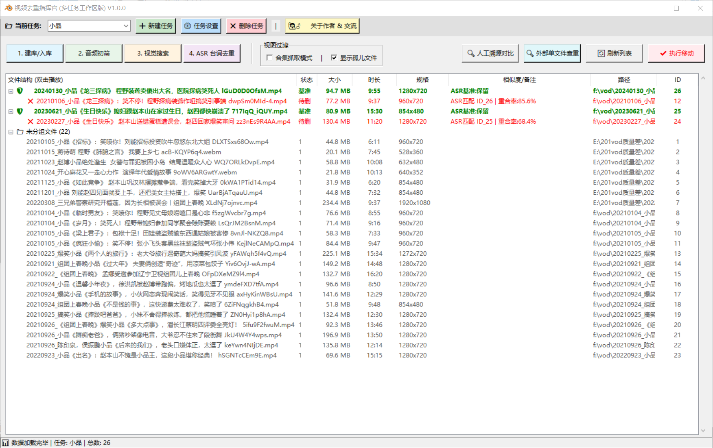
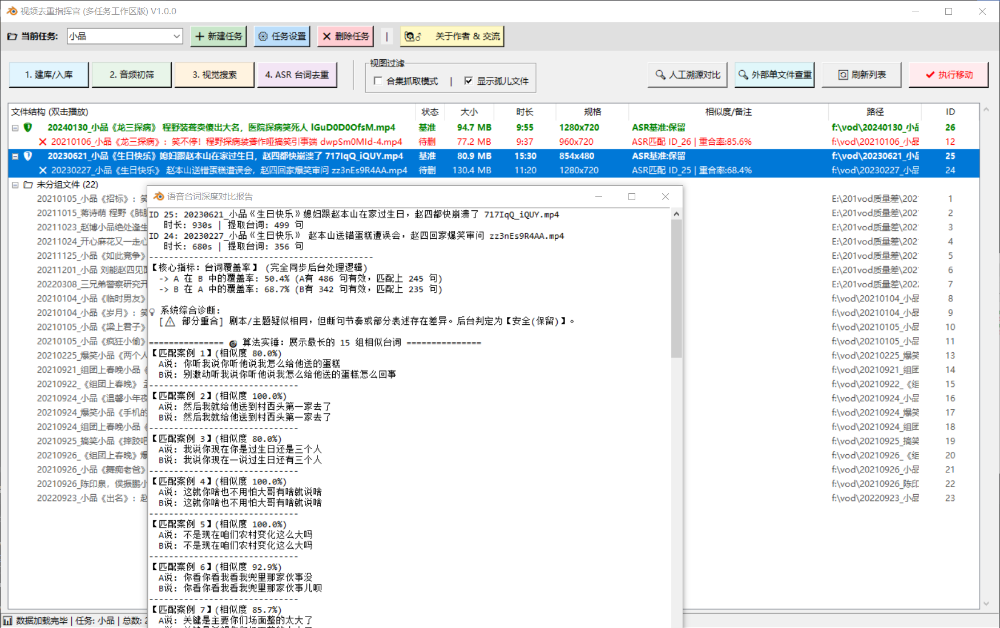
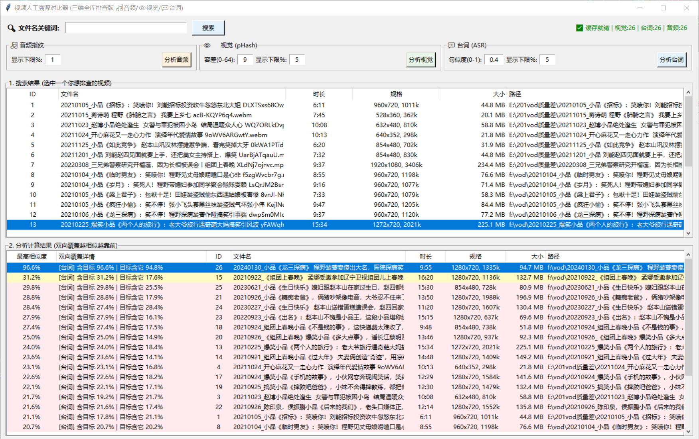
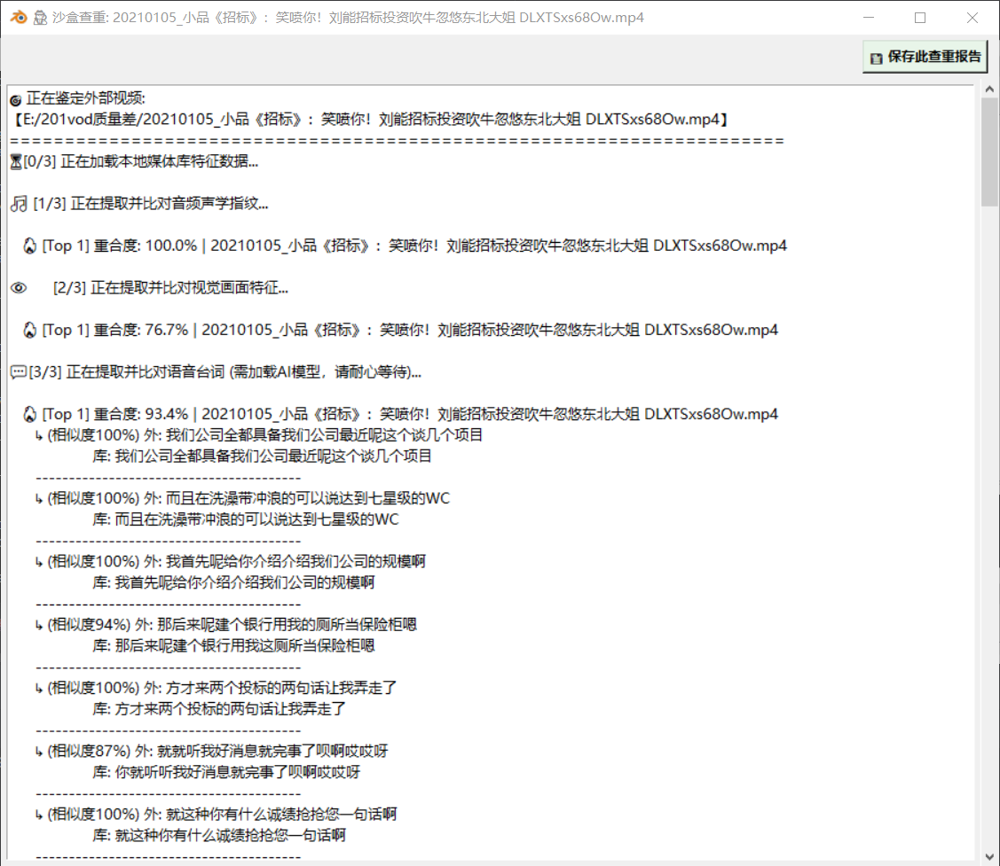

# 🎬 VideoDeduper (视频多模态去重指挥官)


> **专为海量视频囤积者、二创剪辑师打造的“多维度、防洗稿”桌面级去重引擎。**

在短视频洗稿横行的时代，单纯对比文件 MD5 甚至计算画面相似度已经彻底失效。本项目创新性地引入了 **声学特征 (Audio) + 视觉矩阵 (Visual) + 语义台词 (ASR Text)** 三维交叉验证，精准揪出被“掐头去尾、变速变调、镜像翻转、换皮配音”的深度洗稿视频。

---

## 🌟 核心特性 (Key Features)

### 1. 多模态降维打击
*   🎵 **音频初筛 (fpcalc)**：提取底层声学指纹，即使画面全换，只要 BGM 或声音底噪同源，瞬间暴露。
*   👁️ **视觉倒排搜索 (pHash)**：引入 NumPy 矩阵广播加速与位运算，实现 O(1) 级别的海量哈希汉明距离比对，比传统 `for` 循环快百倍。
*   💬 **AI 台词去重 (FunASR ONNX)**：彻底离线运行阿里 Paraformer 大模型，提取台词并进行 O(1) 字典秒杀与模糊字符匹配（数学熔断器机制），哪怕对方换了配音，只要台词剧本一样，依然判定重复！

### 2. 纯离线与隐私安全
*   所有 AI 推理和特征提取均在本地 CPU/GPU 运行。
*   无需调用任何云端 API，完全保护你的私密视频库资产。

### 3. 工程化 GUI 体验
*   支持**多任务工作区**隔离，每个项目独立配置。
*   内置 SQLite 状态机，中途崩溃进度不丢失，支持断点续传。
*   提供“外部单文件查重沙盒”及深度对白实锤报告。

---

## 📸 界面预览 (Screenshots)

### 主界面全览 (带有清晰的父子节点树状视图)



### 深度对比报告 (AI 语义实锤，有理有据)



### 人工溯源排查 (全库相似度矩阵，便捷多选剪切)



### 沙盒查重模式 (像杀毒软件一样鉴定外部视频)



---

## 🚀 快速体验 (面向普通用户)

无需配置复杂的 Python 环境，小白用户可以直接下载打包好的开箱即用版。

1. 前往 [Releases](https://github.com/jamosnet/VideoDeduper/releases) 页面下载最新的 `VideoDeduper_Full.zip`。 
2. 解压到一个**纯英文路径**下。
3. 如果软件弹窗提示缺少依赖，请允许其自动下载（或手动将 `models` 文件夹与所需的 `.exe` 工具放入同级目录）。
4. 双击 `main_gui.exe` 开始你的去重之旅！


---

## 🛠️ 开发者指南 (源码部署)

本项目架构清晰，分为 `db_builder.py` (扫描建库)、`audio_cleaner.py` (音频初筛)、`visual_matcher.py` (视觉匹配) 和 `asr_processor.py` (台词提取) 四大核心模块，由 `main_gui.py` 统筹调度。欢迎开发者 Clone 并魔改。

### 1. 环境准备
推荐使用 Python 3.11 或更高版本。
```bash
git clone https://github.com/jamosnet/VideoDeduper.git
cd VideoDeduper
pip install -r requirements.txt
```
*(注意：本项目默认使用 PyTorch CPU 版本以保证兼容性，如需 GPU 加速请自行替换 PyTorch 版本)*

### 2. 补齐依赖项
由于版权与体积原因，源码库不包含第三方二进制工具和 AI 模型权重。
1.  下载 `ffmpeg.exe`, `ffprobe.exe` 和 `fpcalc.exe` 并放入项目根目录。
2.  前往 https://github.com/jamosnet/VideoDeduper/releases/tag/v1.0.0-asset  下载 `models` 文件夹，并解压到项目根目录。

### 3. 运行主程序
```bash
python main_gui.py
```

---

## 📚 常见问题 (FAQ)

**Q: ASR 台词去重跑得很慢怎么办？**
> A: 语音识别是非常消耗 CPU 算力的过程。如果你的视频库达到上千个，建议在晚上睡觉前挂机运行。你可以随时关闭软件，下次打开会自动跳过已提取的视频（断点续传）。

**Q: 为什么有些明显重复的视频没有被红名标记？**
> A: 系统默认的相似度阈值（如汉明距离容差、台词覆盖率）设定较为保守，以防止误删。你可以在主界面的“⚙️ 任务设置”中，适当调低 `ASR_TEXT_THRESHOLD` 或调高 `HAMMING_TOLERANCE`。

---

## 🤝 参与贡献与交流

开发这个多模态引擎的过程非常漫长且充满挑战，如果你觉得这个工具帮到了你，或者你对视频检索、算法优化有兴趣，**请务必点个 Star ⭐️ 支持一下！**

非常欢迎提交 Issue 和 Pull Request，让我们一起把它做得更好！

*   **GitHub**: [@jamosnet](https://github.com/jamosnet)
*   **邮箱**: jamosnet@outlook.com
*   **QQ**: **8185250**


## 📄 许可证

本项目采用 [MIT License](LICENSE) 协议开源。允许自由商用、修改和分发，但请保留原作者的版权声明。